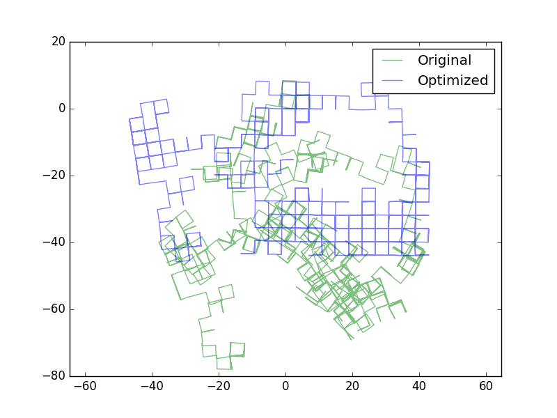

# Toy Pose Graph Optimization with CERES

**Web URL** : [https://kusemanohar.wordpress.com/2017/04/29/howto-pose-graph-bundle-adjustment/](https://kusemanohar.wordpress.com/2017/04/29/howto-pose-graph-bundle-adjustment/).

**Author** : Manohar Kuse : mpkuse [At] connect [.] ust [dot] hk

## Requirements
You need to install ceres-solver and Eigen3 before you can compile this code. 

## How to compile
### Compile
```
mkdir build<br/>
cd build <br/>
cmake .. <br/>
make <br/>
```

This should produce an executable `toy_pose_graph`. Run this executable from build folder. 

### Run Executable 
```
./toy_pose_graph
```

This executable reads file `../input_M3500_g2o.g2o` and produces `../init.txt`  and `../after_opt.txt`. 

### Visualize Results
We have provided a python script to visualize the results. The text files to supply should contain lines as : `id x y theta` representing every node. 

```
cd .. #come out of build directory <br/>
python plot_results.py --initial_poses init.txt --optimized_poses after_opt.txt
```

## List of Files
- **ceres_try.cpp** --> Code to read .g2o file and define cost function
- **input_M3500_g2o.g2o** --> Sample pose-graph. The manhattan dataset. More benchmarking pose-graph [datasets](http://www.lucacarlone.com/index.php/resources/datasets). 
- **plot_results.py** --> Python script to visualize the results


## Result


